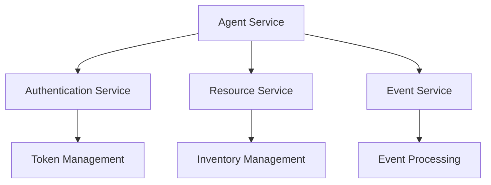
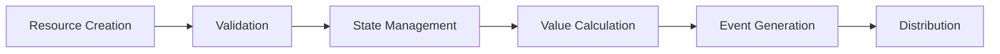
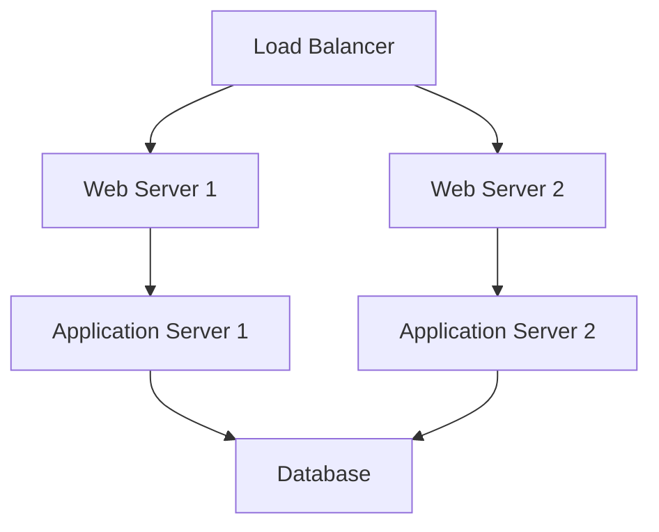
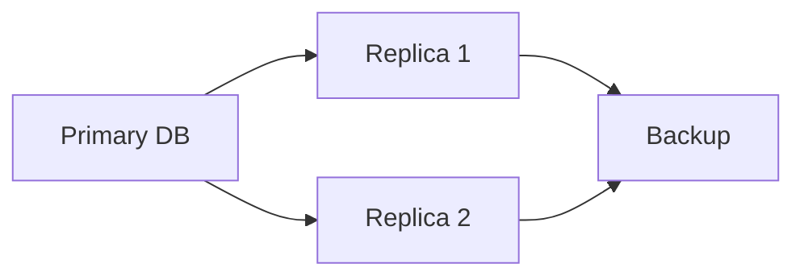
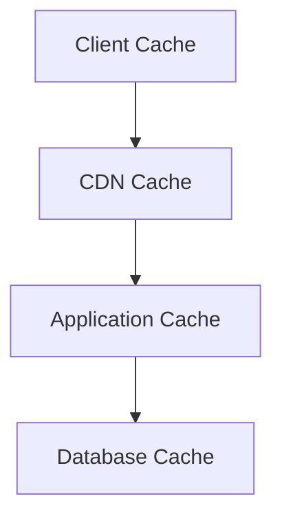
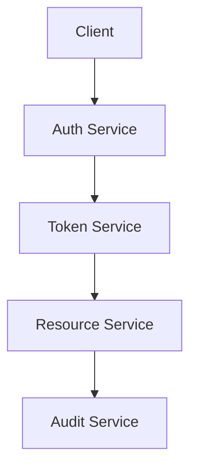
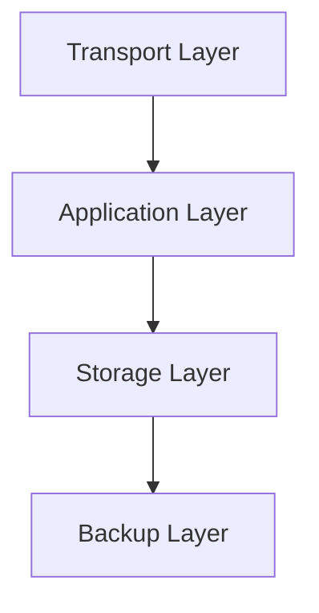

# Detailed Architecture Documentation

## Component Interactions

### 1. Core Service Communication

#### Agent Service Interactions


1. **Agent to Authentication**
   - User authentication requests
   - Token validation
   - Permission checks
   - Session management

2. **Agent to Resource**
   - Resource allocation requests
   - Inventory queries
   - State changes
   - Value calculations

3. **Agent to Event**
   - Event creation
   - Event processing
   - Value distribution
   - Audit logging

### 2. Data Flow Architecture

#### Resource Management Flow


1. **Resource Lifecycle**
   - Creation/Registration
   - State transitions
   - Value tracking
   - Archival/Deletion

2. **Event Processing**
   - Event validation
   - Resource effects
   - Value distribution
   - Audit trail

### 3. Integration Patterns

#### Message-Based Integration
```yaml
Event:
  type: ResourceCreated
  payload:
    resource_id: string
    agent_id: string
    value: decimal
    timestamp: datetime
```

1. **Event Publishing**
   - Resource events
   - Agent events
   - Value events
   - System events

2. **Event Subscription**
   - Resource handlers
   - Agent handlers
   - Value handlers
   - Audit handlers

## Deployment Architecture

### 1. Infrastructure Components

#### Application Tier


1. **Web Tier**
   - Nginx configuration
   - SSL termination
   - Static file serving
   - Request routing

2. **Application Tier**
   - Gunicorn workers
   - Process management
   - Resource allocation
   - Error handling

### 2. Database Architecture

#### Primary-Replica Setup


1. **Data Distribution**
   - Write operations
   - Read distribution
   - Replication lag
   - Backup strategy

2. **Connection Management**
   - Connection pooling
   - Load balancing
   - Failover handling
   - Query routing

### 3. Caching Strategy

#### Multi-Level Caching


1. **Cache Layers**
   - Browser caching
   - CDN caching
   - Application caching
   - Database caching

2. **Cache Management**
   - Cache invalidation
   - Cache warming
   - Cache monitoring
   - Cache optimization

## Security Architecture

### 1. Authentication Framework

#### Authentication Flow


1. **Authentication Methods**
   - Username/Password
   - OAuth 2.0
   - JWT tokens
   - API keys

2. **Token Management**
   - Token generation
   - Token validation
   - Token refresh
   - Token revocation

### 2. Authorization Framework

#### Permission Model
```yaml
Role:
  name: string
  permissions:
    - resource: string
      actions: [create, read, update, delete]
      conditions:
        owner: boolean
        context: string[]
```

1. **Access Control**
   - Role definitions
   - Permission mapping
   - Context validation
   - Action authorization

2. **Policy Enforcement**
   - Request validation
   - Permission checking
   - Context evaluation
   - Audit logging

### 3. Data Security

#### Encryption Layers


1. **Data Protection**
   - TLS configuration
   - Data encryption
   - Key management
   - Secure storage

2. **Security Monitoring**
   - Access logging
   - Security alerts
   - Vulnerability scanning
   - Compliance checking

## Performance Optimization

### 1. Database Optimization

#### Query Optimization
```sql
-- Example optimized query
SELECT r.id, r.name, COUNT(e.id) as event_count
FROM resources r
LEFT JOIN events e ON r.id = e.resource_id
WHERE r.status = 'active'
GROUP BY r.id, r.name
HAVING COUNT(e.id) > 0
```

1. **Index Strategy**
   - Primary keys
   - Foreign keys
   - Composite indexes
   - Partial indexes

2. **Query Performance**
   - Query planning
   - Execution optimization
   - Cache utilization
   - Connection pooling

### 2. Application Optimization

#### Resource Management
```python
class ResourceManager:
    def __init__(self):
        self.cache = Cache()
        self.db = Database()

    async def get_resource(self, id):
        # Check cache first
        if resource := await self.cache.get(id):
            return resource
        
        # Fetch from database
        resource = await self.db.get(id)
        await self.cache.set(id, resource)
        return resource
```

1. **Memory Management**
   - Cache utilization
   - Connection pooling
   - Resource cleanup
   - Memory monitoring

2. **Request Processing**
   - Request queuing
   - Worker management
   - Task prioritization
   - Error handling
