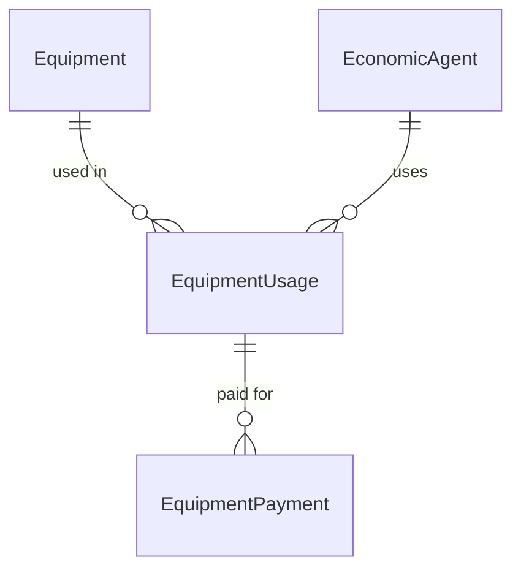
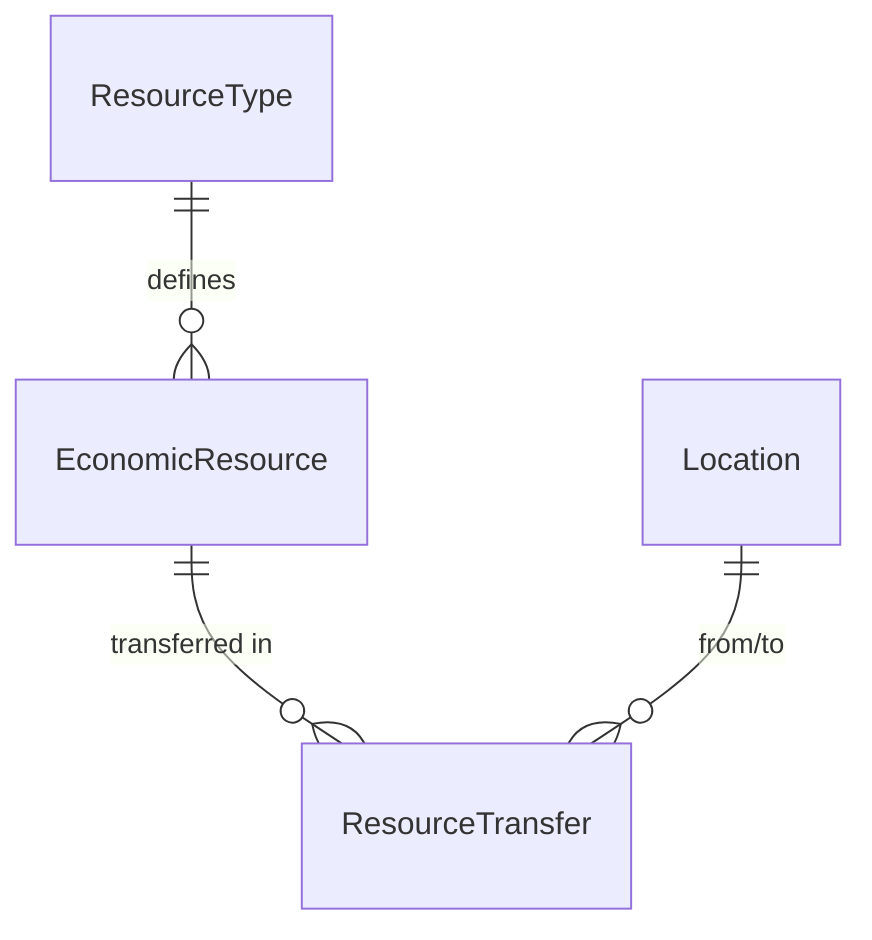
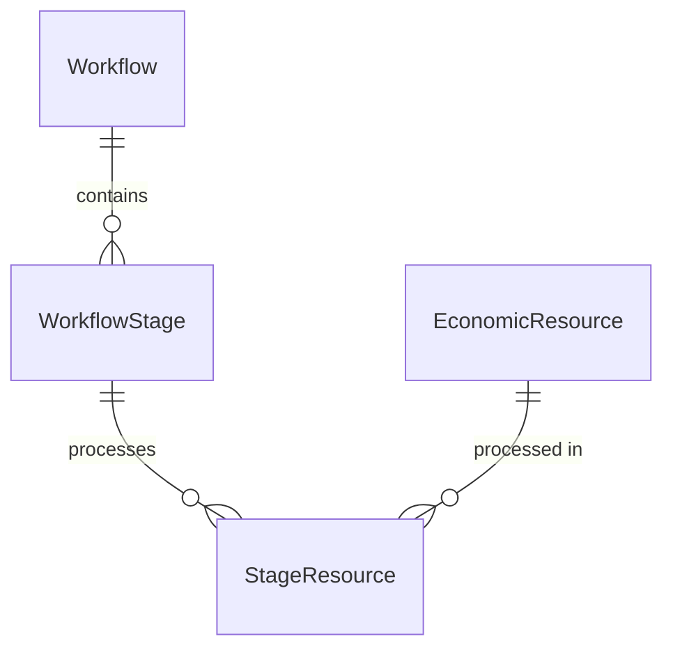

# Database Schema

[← Back to Main Documentation](../README.md)

## Table of Contents
1. [Core Tables](#core-tables)
   - [Equipment Management](#1-equipment-management)
   - [Resource Management](#2-resource-management)
   - [Board Management](#3-board-management)
2. [Key Relationships](#key-relationships)
   - [Equipment Flow](#equipment-flow)
   - [Resource Flow](#resource-flow)
   - [Workflow Flow](#workflow-flow)
3. [Common Queries](#common-queries)
   - [Equipment Queries](#equipment-queries)
   - [Resource Queries](#resource-queries)
   - [Workflow Queries](#workflow-queries)

VerdunNRP uses PostgreSQL with a REA (Resource-Event-Agent) model for managing economic interactions.

## Core Tables

[↑ Back to Top](#table-of-contents)

### 1. Equipment Management

```sql
-- Equipment
CREATE TABLE Equipment (
    id SERIAL PRIMARY KEY,
    name VARCHAR(255) NOT NULL,
    status VARCHAR(50),
    maintenance_status VARCHAR(50),
    location_id INTEGER REFERENCES Location(id),
    created_date TIMESTAMP,
    updated_date TIMESTAMP
);

-- Equipment Usage
CREATE TABLE EquipmentUsage (
    id SERIAL PRIMARY KEY,
    equipment_id INTEGER REFERENCES Equipment(id),
    user_id INTEGER REFERENCES EconomicAgent(id),
    technician_id INTEGER REFERENCES EconomicAgent(id),
    hours DECIMAL(8,2),
    start_time TIMESTAMP,
    end_time TIMESTAMP,
    notes TEXT
);

-- Equipment Payment
CREATE TABLE EquipmentPayment (
    id SERIAL PRIMARY KEY,
    usage_id INTEGER REFERENCES EquipmentUsage(id),
    amount DECIMAL(10,2),
    payment_method VARCHAR(50),
    payment_date TIMESTAMP,
    status VARCHAR(50)
);
```

[↑ Back to Top](#table-of-contents)

### 2. Resource Management

```sql
-- Resources
CREATE TABLE EconomicResource (
    id SERIAL PRIMARY KEY,
    type_id INTEGER REFERENCES ResourceType(id),
    quantity DECIMAL(8,2),
    unit_id INTEGER REFERENCES Unit(id),
    location_id INTEGER REFERENCES Location(id),
    status VARCHAR(50),
    created_date TIMESTAMP
);

-- Resource Types
CREATE TABLE ResourceType (
    id SERIAL PRIMARY KEY,
    name VARCHAR(255) NOT NULL,
    unit_id INTEGER REFERENCES Unit(id),
    category VARCHAR(50),
    description TEXT
);

-- Resource Transfers
CREATE TABLE ResourceTransfer (
    id SERIAL PRIMARY KEY,
    resource_id INTEGER REFERENCES EconomicResource(id),
    from_location_id INTEGER REFERENCES Location(id),
    to_location_id INTEGER REFERENCES Location(id),
    quantity DECIMAL(8,2),
    transfer_date TIMESTAMP,
    notes TEXT
);
```

[↑ Back to Top](#table-of-contents)

### 3. Board Management

```sql
-- Workflows
CREATE TABLE Workflow (
    id SERIAL PRIMARY KEY,
    name VARCHAR(255) NOT NULL,
    description TEXT,
    status VARCHAR(50),
    created_date TIMESTAMP
);

-- Workflow Stages
CREATE TABLE WorkflowStage (
    id SERIAL PRIMARY KEY,
    workflow_id INTEGER REFERENCES Workflow(id),
    name VARCHAR(255) NOT NULL,
    order_index INTEGER,
    status VARCHAR(50)
);

-- Stage Resources
CREATE TABLE StageResource (
    id SERIAL PRIMARY KEY,
    stage_id INTEGER REFERENCES WorkflowStage(id),
    resource_id INTEGER REFERENCES EconomicResource(id),
    status VARCHAR(50),
    entry_date TIMESTAMP
);
```

[↑ Back to Top](#table-of-contents)

## Key Relationships

[↑ Back to Top](#table-of-contents)

### Equipment Flow


### Resource Flow


### Workflow Flow


[↑ Back to Top](#table-of-contents)

## Common Queries

[↑ Back to Top](#table-of-contents)

### Equipment Queries
```sql
-- Get equipment usage history
SELECT e.name, u.hours, u.start_time, p.amount
FROM Equipment e
JOIN EquipmentUsage u ON e.id = u.equipment_id
LEFT JOIN EquipmentPayment p ON u.id = p.usage_id
WHERE e.id = ?;
```

### Resource Queries
```sql
-- Track resource movement
SELECT r.id, t.quantity, t.transfer_date,
       fl.name as from_location, tl.name as to_location
FROM EconomicResource r
JOIN ResourceTransfer t ON r.id = t.resource_id
JOIN Location fl ON t.from_location_id = fl.id
JOIN Location tl ON t.to_location_id = tl.id
WHERE r.id = ?;
```

### Workflow Queries
```sql
-- Get workflow progress
SELECT w.name, s.name as stage, r.id as resource_id,
       sr.status, sr.entry_date
FROM Workflow w
JOIN WorkflowStage s ON w.id = s.workflow_id
JOIN StageResource sr ON s.id = sr.stage_id
JOIN EconomicResource r ON sr.resource_id = r.id
WHERE w.id = ?;
```

[↑ Back to Top](#table-of-contents)
